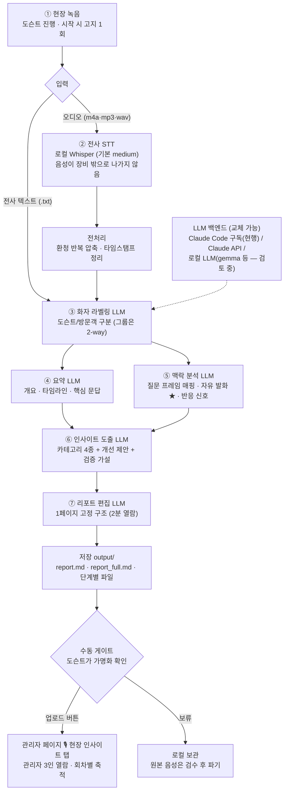

# FieldVoice — 현장 목소리 수집·분석 시스템 (가칭) 설계 문서

> **v0.1 (2026-08-07)** — 신규 아이디어 트랙(`../ideas/`)의 첫 프로젝트. 명칭은 가칭이며
> 변경 시 이 폴더명만 바꾸면 된다 (아직 코드·백엔드 참조 없음).
>
> **트랙 경계**: 이 시스템은 ThinQ Real 메인 시스템·FieldCheck를 수정하지 않는다.
> 백엔드가 필요해지는 단계(Phase 2+)에서도 순수 추가(새 시트 탭 + 새 type 분기)만 사용한다.

## 1. 배경과 목적

ThinQ Real 방문(B2B 시연·R&D 연구·Press Tour)에는 관리자 중 1명이 도슨트로 동행한다.
현재 고객 목소리는 **방문 후 설문**으로만 수집되는데, 설문은 기억과 체면 필터를 거친
"정제된 사후 답변"이다. 시연 순간의 즉석 반응 — 감탄, 머뭇거림, 동행자와의 잡담,
예상 밖의 질문 — 은 어디에도 남지 않는다.

FieldVoice는 **도슨트와 방문객의 현장 대화를 2채널로 녹음하고, 전사·분석해서
인사이트를 도출하는 시스템**이다. FieldCheck가 기계(ThinQ ON)의 상태를 현장에서
수집한다면, FieldVoice는 사람의 목소리를 현장에서 수집한다.

- 도슨트는 설계된 질문 프레임(§3)을 투어 흐름에 녹여 던진다.
- 의도한 질문의 답 밖에서 나오는 **자유 발화가 1급 데이터**다 — 질문-답변 매핑에
  잡히지 않은 구간을 따로 하이라이트하는 것을 분석의 핵심 기능으로 설계한다.
- 예약 데이터(방문 목적·회차)와 연결해 "어떤 방문객이 어디서 반응하는가"를
  교차 분석할 수 있게 한다.

### 영감 출처
롱블랙 기사(https://longblack.co/note/2076/) — 자동차 회사 UX 전략팀의 고객 리서치
방법론. 핵심 주장: 단도직입적 질문("왜 좋아해?", "뭐가 불편해?")은 그럴듯한 거짓말을
만들고, 자신도 알지 못하는 내면의 소리는 **삶에 관한 질문·로망·부러움**으로만 끌어낼
수 있다. 이 원칙을 AI홈 버전으로 이식한 것이 §2~3이다.

## 2. 질문 설계 원칙 (기사에서 추출)

1. **'왜'를 묻지 않는다.** "왜 좋아해?"를 물으면 사람은 이유를 지어내고 스스로도
   그 이야기를 믿는다. 행동·순간·장면을 묻는다.
2. **제품이 아니라 삶을 묻는다.** "가전에서 불편한 점?"이 아니라 "오늘 아침 집을
   나서며 아쉬웠던 순간?"을 묻는다. 고객이 생각지도 못한 불편을 끌어내야 인사이트다.
3. **로망을 묻는다.** 로망은 가치관과 라이프스타일을 드러내고, 욕망을 결정하고,
   욕망은 행동을 결정한다. (기사 예: "자동차 영화 중 가장 멋있는 건?" → 답이
   『포드 V 페라리』면 낮고 시끄럽고 진동 센 차를 원하는 사람)
4. **로망도 꾸며내면, 부러움을 묻는다.** "뭘 하고 싶냐"보다 "뭘 하는 사람이 제일
   부럽냐" — 부러움은 본인이 미처 모르던 지향점을 드러낸다.
5. **경계를 묻는다.** 기사의 "'나를 지켜준다'와 '감시당한다'는 어디서 갈리나요?"는
   자동차보다 **AI홈에 더 절실한 질문**이다 — 집이야말로 센서와 카메라가 사생활의
   한복판에 들어오는 공간이므로, 이 계열 질문을 프레임의 고정 축으로 둔다.

### 하지 않는 질문 (안티패턴)
- "왜 좋으세요?" / "뭐가 불편하세요?" (→ 지어낸 답)
- "우리 집에 있으면 쓰실 것 같아요?" / "구매 의향 있으세요?" (→ 예의상 긍정)
- "월 얼마면 아깝지 않으세요?" (→ 근거 없는 숫자, 앵커링만 남음)

## 3. 질문 프레임 v2 — 운영 프로토콜 × 질문 유형 (2026-08-20 개정)

> v1(설계 초안) → v2: 8/5 파일럿 벤치마크의 실측 발견을 반영. 변경점 = ① 운영
> 프로토콜 2종 분기 ② 공통 운영 수칙 6칙 ③ 신규 질문 3문항 ④ B2B 실무진용 질문셋.

### 운영 프로토콜 분기 (신규)

| 프로토콜 | 조건 | 운영 방식 |
|---|---|---|
| **인터뷰형** | 방문객 1~2인, 대화 가능한 분위기 | 프레임 질문 3~5개를 본격 사용 |
| **그룹 시연형** | 3인 이상 강의형 투어 (8/5 실측: 프레임이 성립하지 않음) | 질문은 1~2개만(이동 구간·클로징), **자유 발화·반응 수집이 주 목적** — 운영 수칙 6칙이 본체 |

### 공통 운영 수칙 6칙 (전부 8/5 실측 근거)

1. **녹음 고지는 시작 시 1회** — 중간 재언급, "좋은 질문이 나왔으면" 류 기대 표명 금지
   (고지 직후 발화 위축 3회 관측)
2. **질문 후 3초 기다린다** — 자문자답 금지 (질문 2초 뒤 "맞습니다"로 닫는 습관이
   "답할 자리가 아니다"를 학습시킴)
3. **한계 자인을 의도적으로 배치** — "사실 그건 무리고" 직후 0.2초 만에 동조 발화 실측.
   이번 회차에서 검증된 유일한 재현 가능 발화 유발 장치
4. **자기개방 후 되묻기 한 문장 고정** — 개인 경험담이 라포를 열면 반드시
   "여러분도 그런 순간 있으셨어요?"로 회수한다 (8/5 최대의 놓친 기회)
5. **시연 대기·장애 구간 = 질문 슬롯** — 질문 카드 3장(로망/아쉬움/미래일기)을 물리
   비치 (8/5 로봇청소기 대기 28분이 독백으로 소진된 교훈)
6. **클로징 후 '앉아서 5분'** — 진짜 자기 집 이야기는 긴장이 풀린 비공식 구간에서
   나온다 (사진·음료 구간에서 첫 자기 집 발화 관측)

도슨트가 회당 **3~5개만** 흐름에 맞게 골라 쓴다 (전부 묻는 인터뷰가 아니라 대화에
녹이는 것). 질문 유형: **로망 / 부러움 / 아쉬움의 순간 / 경계 / 미래 일기**.

| 투어 지점 | 질문 (도슨트 멘트 그대로) | 유형 |
|---|---|---|
| 오프닝 (현관) | "영화나 드라마 보다가 '저 집에서 살아보고 싶다' 했던 장면 있으세요? 어떤 장면이었어요?" | 로망 |
| 오프닝 대안 | "집이나 사는 모습으로 '제일 부러운 사람' 떠오르는 분 있으세요? 뭐가 부러우셨어요?" | 부러움 |
| 거실 (루틴 시연 후) | "오늘 아침 집 나오시면서 '집이 이 정도는 알아서 해줬으면' 싶었던 순간이 있었나요?" | 아쉬움 |
| 거실 (루틴 시연 후) | "방금처럼 집이 먼저 알아서 움직이는 거 — '챙겨준다'는 느낌과 '지켜본다'는 느낌은 어디서 갈릴까요?" | 경계 |
| 주방 | "집에서 마지막으로 '요리다운 요리' 하신 게 언제예요? 그날은 뭐가 달랐어요?" | 삶 |
| 침실 | "아침에 눈 뜨고 침대에서 나오기까지 보통 뭘 하세요?" | 삶 |
| 런드레스룸 | "집안일 중에 딱 하나만 남이 대신 해준다면 뭘 맡기시겠어요?" | 아쉬움 |
| 클로징 | "3년 뒤 어느 저녁 일기에 '집' 얘기가 한 문장 나온다면, 뭐라고 쓰여 있으면 좋겠어요?" | 미래 일기 |
| 클로징 | "오늘 보신 것 중에 집에 돌아가서도 생각날 것 같은 장면 하나만 꼽는다면?" | 반응 검증(우회형) |

- 각 질문 유형은 분석 단계의 인사이트 카테고리와 1:1로 매핑된다:
  로망·부러움 → **가치관·욕망** / 아쉬움·삶 → **페인포인트(JTBD)** /
  경계 → **신뢰·프라이버시 수용선** / 미래 일기·클로징 → **기대와 잔상(반응 강도)**.
- 프레임은 운영하며 개선한다 — 어떤 질문이 답을 여는지/닫는지가 녹음 데이터로
  남으므로, **질문 프레임 자체가 이 시스템의 첫 번째 분석 대상**이다.

### 신규 질문 (v2 — 가설 검증용)

| 질문 | 노리는 것 |
|---|---|
| "지금 집에 딱 하나만 들인다면, 뭐가 바뀔 때 제일 기분이 좋을 것 같으세요?" | 가설 A(저비용 정서 전환) + 구축 아파트 현실 제약 |
| "집에 돈 쓴 것 중에 '이건 진짜 잘 썼다' 싶은 게 있으세요? 얼마쯤이었어요?" | 가격 저항선 실측 (8/5의 1,200만 원 서사 재확인) |
| (경계 질문 후속) "쓴 지 하루 된 집과 3년 된 집이 같은 행동을 하면, 느낌이 다를까요?" | 가설 B(수용선 = 신뢰 축적량의 함수) |

### B2B·계열사 실무진용 질문셋 (신규 — 로망·부러움 프레임이 부적합한 대상)

8/5 실측: 서비스 현장 인력은 제품을 로망이 아니라 **설치·안전·응대 부담**으로 읽는다.

- "고객 댁에서 이 제품을 설명하다 막힐 것 같은 지점이 어디예요?"
- "설치하러 갔을 때 가장 무서운 변수는 뭐예요?"
- "고객이 이걸 물어보면 난감하겠다 싶은 질문 하나만 꼽으면요?"
- "여러분 조직에서 이게 굴러가려면 뭐가 제일 먼저 바뀌어야 해요?"

## 4. 시스템 구조

```
[현장]  2채널 무선 마이크 (도슨트 ch / 방문객 ch)
          → 상주 노트북 녹음 (예약 슬롯 중에만)
[전사]  로컬 Whisper (faster-whisper, 어휘 힌트: ThinQ·가전명·공간명)
          → 채널별 전사 → 시간축 병합 = Q&A 대화록
[분석]  LLM 계층 (전사 텍스트 입력)
          → 질문 프레임 매핑 + 자유 발화 하이라이트 + 카테고리별 인사이트
[저장]  새 시트 탭 voc_sessions / voc_insights (+ 예약 ID 연결)
          → (Phase 3+) 관리자 탭 또는 리포트
```

### 전체 플로우차트 (GitHub에서 다이어그램으로 렌더됨)



사용자 관점의 큰 흐름 **'녹음 → STT → LLM → 분석 결과서'**가 골격이고, LLM 구간이
5개 전문 단계로 나뉘며(한 번에 다 시키면 얕아짐), 수동 게이트 2곳(분석 시작·업로드)만
사람이 개입한다.

### 역할 분담 — Whisper에 대한 오해 방지
- **Whisper = 전사만** 담당한다. 맥락 분석·화자 분리는 Whisper의 일이 아니다.
- **맥락 분석 = LLM 계층**. 전사가 텍스트로 나오면 분석 품질은 STT와 분리된다.
- **화자 분리 사다리** (위에서부터 시도, 실패 시 아래로):
  1. 하드웨어 채널 분리 (마이크가 L/R 분리 지원 시 — 공짜·가장 견고)
  2. LLM 내용 기반 라벨링 (도슨트 발화는 질문 프레임의 알려진 문장 → 텍스트만으로 구분)
  3. 로컬 diarization (pyannote 등)
  4. 클라우드 STT 내장 화자 분리 (클로바 스피치 등 — 아래 게이트 통과 시에만)

### 전사 품질 갈림길 (Phase 1 실측으로 결정)
FieldCheck의 6초 단문과 달리 90분 대화·겹침말·쇼룸 소음이라 난도가 다르다.
- 1안 (기본): 로컬 faster-whisper large — 음성이 장비 밖으로 안 나감, 과금 없음.
- 2안 (로컬 품질 부족 시): 한국어 특화 클라우드 STT (클로바 스피치 등).
  **고객 음성이 외부로 나가는 순간 동의 문구·보안 검토가 무거워진다** — 채택하려면
  §5 동의서에 클라우드 처리 명시 + 사내 컴플라이언스 재확인이 선행 조건.

### 기존 인프라와의 관계
- **FieldCheck와 충돌 없음**: FieldCheck는 예약 슬롯을 회피해서 돌고(시작 20분 전
  ~ 종료 10분 후), FieldVoice는 예약 슬롯 중에만 녹음한다 — 시간대가 정확히 갈린다.
  마이크도 FieldCheck는 내장, FieldVoice는 별도 USB 수신기.
- 백엔드는 Phase 2까지 무변경. Phase 2+에서 FieldCheck의 `health_check` 선례와
  동일 패턴(새 탭 + 새 POST type + Script Properties 인증 키)으로 순수 추가.
- 원본 음성 파일은 GitHub·시트에 절대 올리지 않는다 (§5).

## 5. 녹음 동의 (가동 전 필수 게이트)

방문객 음성은 개인정보다. **이 절차가 확정·이행되기 전에는 실녹음을 시작하지 않는다.**

1. **동의 체계 (확정 — 2026-08-20 사용자 결정)**: ① 방문 예약 단계의 기존 개인정보
   동의(예약 폼) + ② 투어 시작 시 도슨트의 **구두 고지 1회**("분석을 위해 녹음합니다")
   로 운영한다 — 별도 서면 동의서는 만들지 않는다. **마이크를 건네는 행위 자체가
   자연스러운 고지 접점**이 된다.
   - 권고 1건: 예약 폼의 개인정보 동의 문안이 '음성 녹음·분석' 목적을 포괄하는지
     1회만 확인해 두면 근거가 완결된다 (포괄하지 않으면 문안에 한 줄 추가 검토)
2. **거부 시**: 그 회차는 녹음 없이 진행한다. 시스템이 강제하지 않는다.
3. **원본 음성**: 로컬(또는 사내 저장소)에만 보관, 전사 검수 후 파기 기한 내 삭제
   (기한은 동의서에 명시한 값을 따른다 — 초안: 30일).
4. **시트·저장소에는** 전사·인사이트만 올리며, 이름·소속 등은 가명 처리한다.
5. **사내(LG) 컴플라이언스 확인**: 고객 음성 수집에 대한 사내 규정 확인은 운영자
   (강원석)의 가동 전 숙제 — 확인 결과를 이 문서에 기록한 뒤 Phase 1을 시작한다.
6. 클라우드 STT 채택 시(§4 2안) 동의서 문구·검토를 갱신해야 한다.

## 6. 장비

### 파일럿 장비: 비욘드터치 에어마이크 프로 듀얼 (동료 대여 — 비용 0원)
송신기 2 + USB-C 수신기 1, 2.4GHz, 30m. "듀얼마이크 녹음"(2개 동시)은 공식 지원이나
**두 마이크가 L/R 채널로 분리되는지, 믹스되는지는 공개 스펙에 없음** (분리 모드가 있는
제품군은 보통 이를 전면에 광고하므로 믹스형 가능성이 높다고 추정).

**채널 분리 테스트 (대여 후 5분, Phase 1 첫 작업)**:
1. 마이크 2개를 켜고 녹음 시작
2. 마이크 A에만 "하나 둘 셋" → 쉬고 → 마이크 B에만 "넷 다섯 여섯"
3. 이어폰 양쪽을 끼고 재생:
   - 한쪽 귀에서만 들림 → **분리형** — 이 제품 그대로 사용
   - 양쪽에서 똑같이 들림 → **믹스형** — 파일럿은 그대로 진행(수동 판독은 사람 귀로
     구분 가능), 자동화 단계에서 화자 분리 사다리(§4) 2번 이하로 대응. 그래도
     부족하면 그때 분리 지원 마이크(예: Rode Wireless GO II 계열) 구매 검토.

### 구매로 넘어갈 경우 확인 조건 (웹캠 선례의 "구매 전 확인" 방식)
① 채널 분리(스플릿/스테레오 모드) 명시 지원 ② USB 수신기가 표준 오디오 장치로 인식
(무드라이버) ③ 온보드 녹음(수신 끊겨도 송신기에 저장) 있으면 가점 ④ 90분 연속 배터리.

## 7. 로드맵

| Phase | 내용 | 게이트 |
|---|---|---|
| **0. 설계** | 이 문서 + 질문 프레임 v1 + 동의서 초안 (비용 0) | — |
| **1. 파일럿** | 마이크 대여 → 채널 테스트 → 동의받은 방문 1~2건 **수동 녹음·수동 판독** — "이 데이터에 정말 인사이트가 있는가" 검증 | §5 동의 절차 확정 + 컴플라이언스 확인 |
| **2. 전사 자동화** | Whisper 파이프라인 + 전사 품질 실측(§4 갈림길 결정) + 시트 기록(백엔드 순수 추가) | Phase 1에서 가치 확인 |
| **3. 분석 자동화** | LLM 인사이트 추출 + 자유 발화 하이라이트 + 예약 교차 분석 + 질문 프레임 개선 루프 | Phase 2 품질 통과 |

FieldCheck의 교훈 그대로: **도구 사전 검증 → 현장 실측 → 자동화 편입**. 자동화 투자는
파일럿이 가치를 증명한 뒤에만 한다.

## 8. 관리자 페이지 연동 (Phase 2 구체 설계 — 2026-08-19)

리포트가 도슨트 개인 폴더에 머물지 않고 **ThinQ Real 관리자 대시보드에 회차별로 쌓이는**
구조. FieldCheck `health_checks` 선례(순수 추가: 새 탭 + 새 type + Script Property 키)를
그대로 따른다. 구현은 실서비스 저장소(`wonseok0415/thinqreal`) 작업이므로 별도 작업 단위.

### 데이터 흐름
```
파이프라인 report.md (1페이지 요약 — compile 에이전트가 고정 구조로 생성)
  → [수동 확인 게이트] 도슨트가 가명화·내용 확인 후 업로드 버튼 클릭 (자동 업로드 금지)
  → POST type:voc_report (FV_API_KEY 인증)
  → Sheets `voc_reports` 탭 (자동 생성 — roi_snapshots 패턴)
  → 관리자 대시보드 🎙 현장 인사이트 탭 (분석 섹션, 🩺 탭 선례)
```

### 스키마·엔드포인트 (안)
- `voc_reports` 컬럼: `id`, `timestamp`, `visit_date`, `session_id`, `purpose(방문 목적)`,
  `one_liner(한 줄 결론)`, `report_md(1페이지 전문)`, `consent(구두/서면)`, `author`
- `POST type:voc_report` — `FV_API_KEY`(Script Property, FC_API_KEY 선례) 인증, 실패 시 전부 거부
- `GET ?type=voc_reports&days=N` — **처음부터 관리자 토큰 게이트 적용**. FieldCheck의
  `health_checks` 무인증 GET이 백로그로 남은 교훈 + 이 데이터는 방문객 발화 인용이 포함되어
  민감도가 더 높음
- 탭 UI: 회차 리스트(방문일·목적·한 줄 결론) → 클릭 시 1페이지 리포트 렌더. 회차가 쌓이면
  "반복 등장 인사이트" 집계가 다음 단계 (가설의 표본 누적 검증)

### 원칙
1. **업로드는 1페이지 요약만** — 원본 음성·전사·상세 리포트는 절대 업로드하지 않는다 (§5)
2. **수동 게이트 필수** — LLM 출력이 가명화를 놓칠 수 있으므로 사람 확인 후 업로드
3. **이관 정합**: 엔드포인트·키는 config 분리(FieldCheck §10 동일). 신설 시
   `docs/migration/api-contract.md`에 존재·인증 방식을 등재해 이관 계약에 포함시킨다

## 9. 미결정 사항

- [ ] 시스템 명칭 확정 (가칭 FieldVoice)
- [x] ~~동의서 문안 작성~~ → 서면 생략 확정 (예약 동의 + 현장 구두 고지 — §5, 2026-08-20)
- [ ] 예약 폼 개인정보 동의 문안에 '음성 녹음·분석' 포괄 여부 1회 확인 (§5 권고)
- [x] ~~파일럿 대상 회차 선정~~ → 8/5 계열사 방문분으로 완료
- [ ] 원본 음성 파기 기한 확정 (초안 30일)
- [ ] 녹음 장비 운영 주체 (도슨트 3인 로테이션과의 접점 — 누가 켜고 끄나)
- [ ] 롱블랙 기사 질문 중 미이식분 검토 (기사 전문 확보 시)
